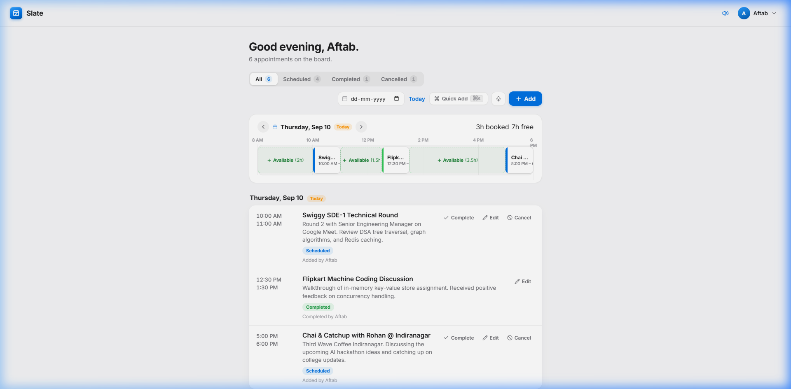
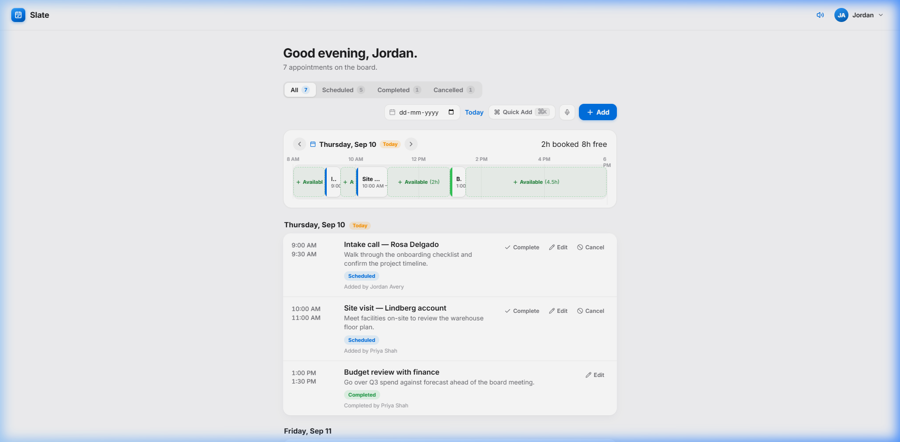
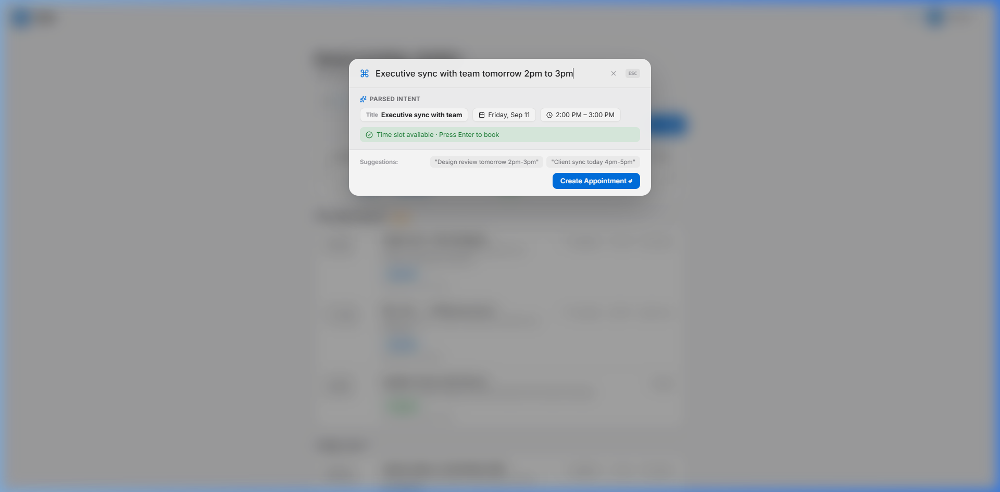
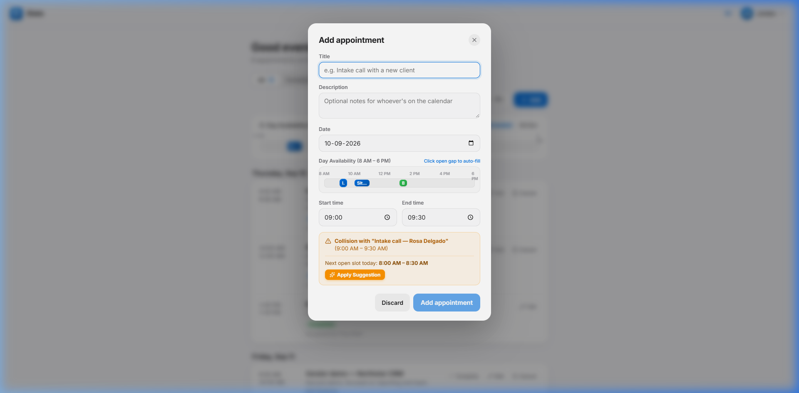

# Slate Appointment Board

A full-stack appointment board for teams. Built with React (Vite) on the frontend and FastAPI (Python) on the backend.



## Overview

- View appointments grouped by date and sorted chronologically by start time.
- Add new appointments with title, description, date, and time range.
- Edit any appointment (scheduled, completed, or cancelled).
- Complete a scheduled appointment to mark it as done.
- Cancel an appointment. Cancelled appointments remain visible with strike-through styling and can be restored.
- Filter by status (All, Scheduled, Completed, Cancelled) and by date.
- Overlap prevention: strict server-side validation and client-side conflict checking reject overlapping appointments on the same date.

## Features

### 1. Day Schedule Track



An interactive calendar timeline spanning 8:00 AM to 6:00 PM positioned above the appointment list.
- Stepper controls to navigate between previous and next days, with a shortcut button to jump back to today.
- Appointment blocks displayed with status-colored bars and time ranges.
- Open intervals render as clickable Available cards that automatically prefill the booking form.

### 2. Voice Dictation Quick Add

Supports hands-free appointment creation using the browser native Web Speech API.
- Microphone button activates real-time speech-to-text dictation.
- Spoken phrases like "Swiggy Tech Round tomorrow 2pm to 3:30pm" are transcribed live and passed into the parser.
- Built without external speech libraries or third-party API dependencies.

### 3. Command Palette (Cmd+K / Ctrl+K)



A quick-entry search and booking bar accessible via keyboard shortcut (Cmd+K or Ctrl+K).
- Uses a natural language parser to extract title, date, and start/end times.
- Real-time chip preview displays parsed parameters before creation.
- Pressing Enter creates the appointment immediately if the slot is open.

### 4. Smart Conflict Resolver



When a chosen time overlaps with an existing appointment:
- The system highlights the conflicting appointment and its time range.
- It scans the schedule and computes the next available gap of the same duration.
- An Apply Suggestion button allows one-click adoption of the open slot.

### 5. Synthetic Audio Feedback

Optional subtle tactile clicks for controls and a completion chime when finishing an appointment.
- Generated client-side using the Web Audio API without audio media files.
- Includes an audio toggle button in the top navigation bar.

## Tech Stack

| Layer | Technology | Purpose |
| --- | --- | --- |
| Frontend | React 19, Vite | UI components and client state |
| Backend | FastAPI, SQLModel | REST API, SQLite database, and validation |
| Styling | Vanilla CSS | Custom design system and CSS variables |
| Testing | Pytest, HTTPX | Automated test suite for CRUD and conflict logic |
| Audio | Web Audio API | Client-side synthesized feedback |
| Voice | Web Speech API | Native in-browser speech recognition |
| Animation | GSAP | Modal transitions and list stagger animations |
| WebGL | Custom GLSL Shaders | Mesh gradient background on login screen |

## How to Run

### Backend

```bash
cd backend
python -m venv venv
venv\Scripts\activate       # Windows
# source venv/bin/activate  # macOS / Linux

pip install -r requirements.txt
uvicorn main:app --reload --port 8000
```

The API runs at `http://localhost:8000`. Interactive OpenAPI documentation is available at `/docs`.

To run tests:
```bash
pytest -v
```

### Frontend

```bash
cd frontend
npm install
npm run dev
```

The application runs at `http://localhost:5173` and communicates with the backend on port 8000.

## Project Structure

```
├── backend/
│   ├── main.py             # FastAPI application and route handlers
│   ├── models.py           # SQLModel database models and Pydantic schemas
│   ├── db.py               # Database engine, session provider, seed data
│   ├── tests/
│   │   └── test_api.py     # Pytest test suite
│   └── requirements.txt
│
├── frontend/
│   ├── src/
│   │   ├── components/
│   │   │   ├── AuthGate.jsx        # Login and registration view
│   │   │   ├── BoardShell.jsx      # Main layout and top navigation
│   │   │   ├── FilterBar.jsx       # Status filter tabs and date selector
│   │   │   ├── TimeStrip.jsx       # Day schedule timeline and navigator
│   │   │   ├── CommandPalette.jsx  # Cmd+K quick add and voice input
│   │   │   ├── SlotList.jsx        # Grouped appointment list
│   │   │   ├── SlotCard.jsx        # Appointment card item
│   │   │   ├── SlotModal.jsx       # Add and edit appointment modal
│   │   │   └── Toast.jsx           # Notification alert pill
│   │   ├── hooks/
│   │   │   └── useBoard.js         # Board state management and API sync
│   │   ├── gl/
│   │   │   └── aurora.js           # WebGL shader renderer
│   │   ├── lib/
│   │   │   ├── api.js              # Fetch client for backend endpoints
│   │   │   ├── audio.js            # Synthesized audio effects
│   │   │   ├── voice.js            # Speech recognition wrapper
│   │   │   ├── nlp.js              # Natural language query parser
│   │   │   └── time.js             # Date and time calculations
│   │   ├── App.jsx                 # Root component
│   │   ├── main.jsx                # Entry file
│   │   └── index.css               # Stylesheet and design system
│   └── index.html
│
└── README.md
```

## Testing and Quality

The backend includes an automated test suite located at `backend/tests/test_api.py`:
1. `test_list_slots_empty`: Verifies empty list response when no slots exist.
2. `test_create_slot_success`: Verifies valid appointment persistence.
3. `test_overlap_same_day_rejected`: Verifies HTTP 409 Conflict when slots overlap.
4. `test_adjacent_slots_allowed`: Confirms that back-to-back appointments (such as 10:00 to 11:00 and 11:00 to 12:00) are permitted.
5. `test_overlap_different_days_allowed`: Confirms identical times on different dates do not conflict.
6. `test_cancelled_slot_does_not_block_booking`: Confirms cancelled appointments free up their time slot.
7. `test_patch_status_transitions`: Validates lifecycle status changes (scheduled to completed, cancelled, and restored).

## How It Works

1. **Initial Load and Pre-Seeded Board**:
   On startup, the backend automatically initializes database tables and seeds realistic appointments. The client fetches `GET /api/slots`, organizes records chronologically by date, and calculates status counters.

2. **Schedule Visualizer**:
   The Day Schedule Track renders an 8:00 AM to 6:00 PM timeline. Unoccupied periods are identified as available windows. Clicking an open window opens the booking form with those times populated.

3. **Collision Detection and Validation**:
   Validation checks that all required fields are provided, that the end time is after the start time, and that the interval does not intersect an active appointment on the same date. When an overlap occurs, the backend rejects the request with HTTP 409 Conflict.

4. **Lifecycle and Audit Attribution**:
   Appointments move between scheduled, completed, and cancelled states. Cancelled appointments remain displayed with distinct styling and can be restored. Every status change records the modifying user.

5. **User Feedback**:
   Actions trigger visual toast notifications, inline error messages, and optional audio ticks.

## Assumptions Made

1. **Overlap Rules**:
   Intervals are treated as half-open: an appointment ending at 11:00 AM does not conflict with one starting at 11:00 AM. Cancelled appointments release their time slot so another meeting can take place in that window.

2. **Timezone Handling**:
   Dates and times represent local wall-clock time (`YYYY-MM-DD` and `HH:MM:SS`) to prevent unexpected timezone conversion shifts.

3. **Team Context**:
   Built for internal team usage with local attribution tracking (`touched_by`).

4. **Working Hours**:
   The timeline visualizer displays business hours from 8:00 AM to 6:00 PM, while allowing manual booking outside this range if required.
